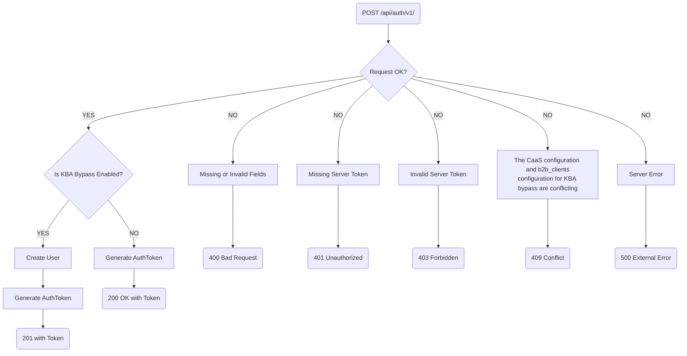
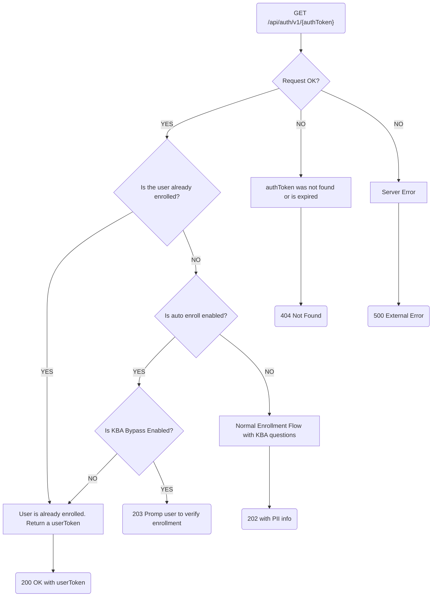
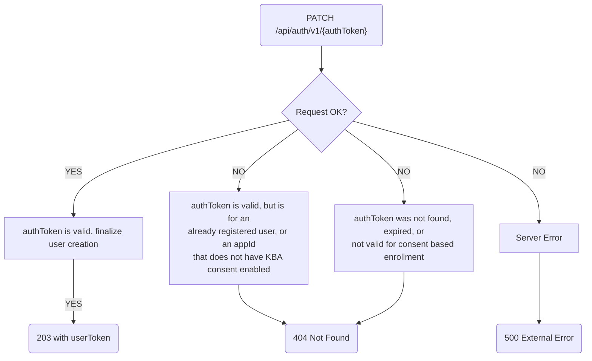
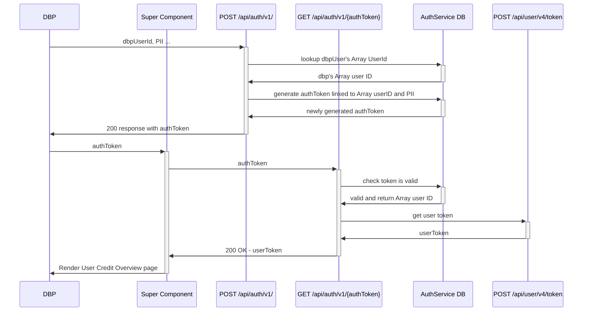
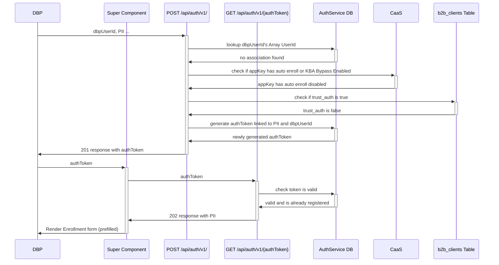
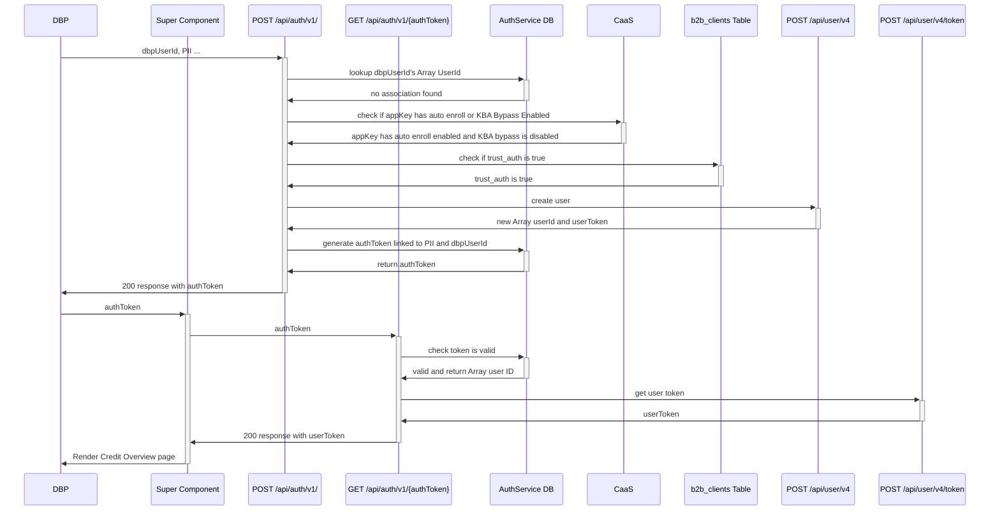
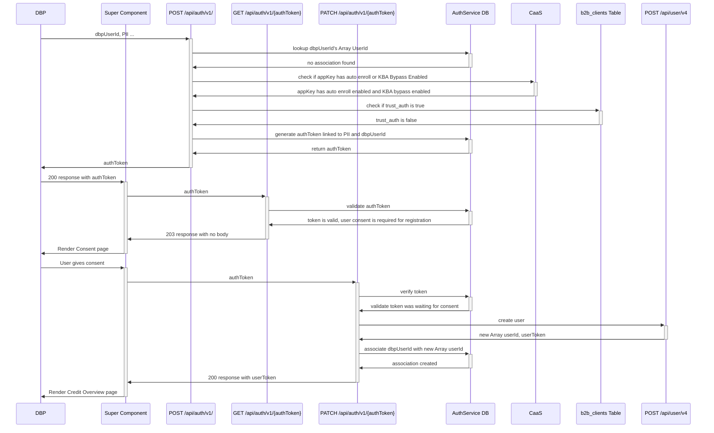
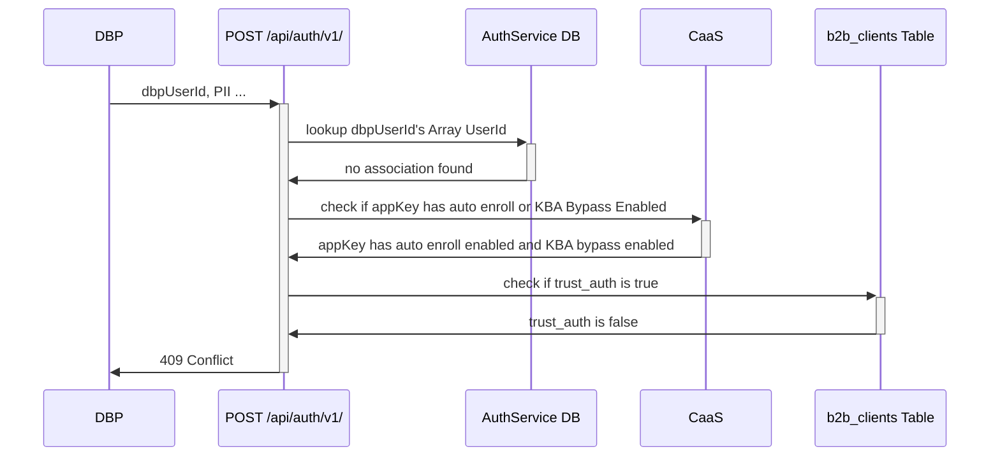
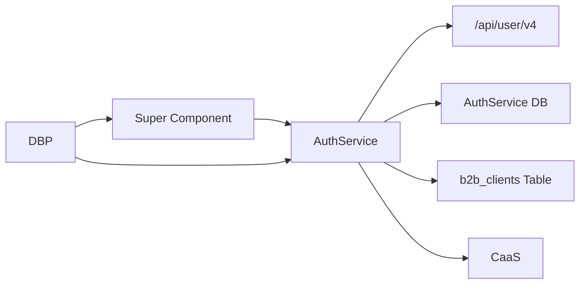

**Software Design Specification**  
CP11 Auth Service

[[_TOC_]]

## Overview

* **Status:** In Progress
* **Stakeholders:**
    * **Responsible:**
        * @tyler.findlay
        * @luke.norman
    * **Accountable:**
        * @surya.manchikanti
    * **Consulted:**
        * @phillip_array
    * **Informed:**
        * 
* **Related Links:**
    * **Product Brief:** [DBP Auth Service/Supercomponent Integration](https://docs.google.com/document/d/1t0M2GRUd_5qkCdYkm2ZsaIxftC2i2TBFPNEjFJOAu6k)
    * **Shortcut Epic:** [CP11 integration](https://app.shortcut.com/arrayus/epic/52574)
    * **AuthService API Spec:** [AuthService API](https://gitlab.com/array.com-internal/engineering/specifications/api-specifications/-/blob/squad-4-deploy-fi/sc-52367/design-documents-for-cp11-authservice/_api-authservice.zed)
    * **User API Spec v4:** [User API v4 spec](https://gitlab.com/array.com-internal/engineering/specifications/api-specifications/-/blob/v4/api-user.zed)
    * **Super Component Documentation:** [Super Component Documentation](https://gitlab.com/array.com-internal/engineering/specifications/design-specifications/-/blob/squad-4-deploy-fi/sc-50177/create-fe-sds-template/js/website-webcom-svelte/001_SuperComponent.md)
* **Summary:**

This specification describes a new auth service which serves the purpose of allowing DBPs to authenticate with Array using the DBPs user ID. The AuthService also manages different enrollment types (auto enroll and KBA bypass) based on the appKey configured settings in the CaaS.

## Context

### Goal

The existing authentication API requires DBPs to store Array user IDs and manage the enrollment process within each platform. The goal of this new API is to provide an alternate API route that allows for authentication with Array without having to store Array user IDs, and specify the enrollment process based on DBP needs.

### Problem

1. Currently, authentication must happen using Array enrollment components. This API will offer a route to pass an authentication token to a super component (still in development) that would automatically render an enrollment flow for unenrolled users, or a credit report to enrolled users without the DBP needing to know if a given user is enrolled or not.
2. DBPs are required to handle the mapping of one of their user ID's to the respective Array user ID. This service will use the DBP user ID to identify users.

### Limitations

None identified.

### Success Criteria

1. An API endpoint that
    - returns an auth token based on the appKey and DBP user ID and PII information provided
    - if the appId has `autoEnroll` enabled, enrolls that user immediately and returns an auth token
2. An API endpoint that can use an auth token to retrieve
   - A 200 reponse if the user is already registered including a user token
   - A 202 response if the user is not registered and auth enrolled is not enabled including any Customer PII information stored
   - A 203 if the user is not registered, auto enrolled is enabled, and consent is enabled
3. An API endpoint that exchanges an finalizes an enrollment with KBA
4. A data store that:
    - maps appKey/dbpUserId pairs to Array user IDs
    - stores authTokens

## Architecture

### Diagrams

#### API Flow Chart

##### `POST /api/auth/v1/`

##### `GET /api/auth/v1/{authToken}`

##### `PATCH /api/auth/v1/{authToken}`

#### Sequence Diagram

##### Enrolled user

##### Unenrolled user with Auto Enroll disabled

##### Unenrolled user with Auto Enroll enabled and KBA Bypass Disabled

##### Unenrolled user with Auto Enroll enabled and KBA Bypass Enabled

##### Conflicting CaaS and `b2b_clients` settings

### Connected Systems

## Timeline

* One engineer is required for completion of this feature, but two working together might be beneficial due to complexity.
* Feature is critical to the Supercomponent, as well as CP11 integration with DBPs on the Deploy FI team (Alkami, Banno, Q2).

#### How would this design change if we had infinite resources?

* Fast response time from the auth generation endpoint so there would be no requirement for cacheing tokens on the DBP end
